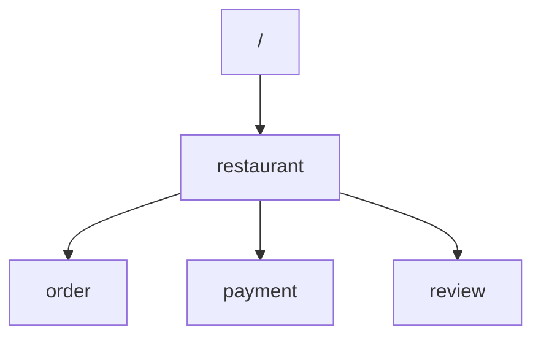

# firepath - Code generation command that get path to firestore's collections or documents

## Usage

### Collection structure in firestore



### Input file

```txt
# Collection Name      Collection Structure
restaurant             /restaurant
review                 /restaurant/reviews
order                  /restaurant/orders
payment                /restaurant/payments
```

### Execute firepath command

```sh
# To generate code in javascript
$ firepath --language==js input_file > path.js

# To generate code in Java
$ firepath --language==java input_file > Firepath.java
```

### Output File

<details>
<summary> path.js </summary>

```js
/*
 * This file is automatically generated by 'firepath' command.
 * You can see more details here.
 * https://github.com/ppdx999/firestore
 */

export function restaurantCollectionPath() {
  return "/restaurant";
}

export function restaurantDocumentPath(restaurantId) {
  return "/restaurant/" + restaurantId;
}

export function reviewCollectionPath(restaurantId) {
  return "/restaurant/" + restaurantId + "/reviews";
}

export function reviewDocumentPath(restaurantId, reviewsId) {
  return "/restaurant/" + restaurantId + "/reviews/" + reviewsId;
}

export function orderCollectionPath(restaurantId) {
  return "/restaurant/" + restaurantId + "/orders";
}

export function orderDocumentPath(restaurantId, ordersId) {
  return "/restaurant/" + restaurantId + "/orders/" + ordersId;
}

export function paymentCollectionPath(restaurantId) {
  return "/restaurant/" + restaurantId + "/payments";
}

export function paymentDocumentPath(restaurantId, paymentsId) {
  return "/restaurant/" + restaurantId + "/payments/" + paymentsId;
}
```

</details>

<details>
<summary> Firepath.java </summary>

```java
/*
* This file is automatically generated by 'firepath' command.
* You can see more details here.
* https://github.com/ppdx999/firestore
*/

package test.java;

public class Firepath {

  private static String makeRecursivePath(String name, String[] ids) {
    StringBuffer path = new StringBuffer();
    for(String id : ids){
        path.append("/" + name + "/" + id );
    }
    return path.toString();
  }

  public static String restaurantCollectionPath() {
    return  "/restaurant";
  }

  public static String restaurantDocumentPath(String restaurantId) {
    return "/restaurant/" + restaurantId;
  }

  public static String reviewCollectionPath(String restaurantId) {
    return "/restaurant/" + restaurantId +  "/reviews";
  }

  public static String reviewDocumentPath(String restaurantId, String reviewsId) {
    return "/restaurant/" + restaurantId + "/reviews/" + reviewsId;
  }

  public static String orderCollectionPath(String restaurantId) {
    return "/restaurant/" + restaurantId +  "/orders";
  }

  public static String orderDocumentPath(String restaurantId, String ordersId) {
    return "/restaurant/" + restaurantId + "/orders/" + ordersId;
  }

  public static String paymentCollectionPath(String restaurantId) {
    return "/restaurant/" + restaurantId +  "/payments";
  }

  public static String paymentDocumentPath(String restaurantId, String paymentsId) {
    return "/restaurant/" + restaurantId + "/payments/" + paymentsId;
  }

}

```

</details>

## Bugs

- swift, c++, go, PHP are not supproted

## Others

```man
NAME
    firepath - Generate functions or methods to get path to firestore's collections or documents

SYNOPSIS
    firepath [OPITON]... [FILE]

DESCRIPTION
    With no FILE, read standard input.

    -o <file>, --output
          Write output data to <file>, with no <file>, write it to /dev/stdout

    -l <js|ts|java|kt>, --language
          Specify the language to generate.

    -a <language-specific-parameter>    |--additional-parameters==<language-specific-parameter>
          Additonal parameters for language-specific configuration.
          Specify options like, 'key1=value1,key2=value2,key3=value3'

          java:
            package=my.package
            classname=MyFirepath

          javascript/typescript:
            no additioanl option is supported

Example
    Structure of collections in firestore
      ----------------------------------------------------------
        restaurant ─────── review
                      ├─── order
                      ├─── payment
      ----------------------------------------------------------

    input (write collections structure)
      ----------------------------------------------------------
        # name                      path
        restaurant                  /restaurant
        review                      /restaurant/review
        order                       /restaurant/order
        payment                     /restaurant/payment
      ----------------------------------------------------------

    output ( javascript )
      ----------------------------------------------------------
        /*
        * This file is automatically generated by 'firepath' command.
        * You can see more details here.
        * https://github.com/ppdx999/firestore
        */

        export function restaurantCollectionPath() {
          return  "/restaurant";
        }

        export function restaurantDocumentPath(restaurantId) {
          return "/restaurant/" + restaurantId;
        }

        export function reviewCollectionPath(restaurantId) {
          return "/restaurant/" + restaurantId +  "/reviews";
        }

        export function reviewDocumentPath(restaurantId, reviewsId) {
          return "/restaurant/" + restaurantId + "/reviews/" + reviewsId;
        }

        export function orderCollectionPath(restaurantId) {
          return "/restaurant/" + restaurantId +  "/orders";
        }

        export function orderDocumentPath(restaurantId, ordersId) {
          return "/restaurant/" + restaurantId + "/orders/" + ordersId;
        }

        export function paymentCollectionPath(restaurantId) {
          return "/restaurant/" + restaurantId +  "/payments";
        }

        export function paymentDocumentPath(restaurantId, paymentsId) {
          return "/restaurant/" + restaurantId + "/payments/" + paymentsId;
        }

      ----------------------------------------------------------

AUTHOR
    Written by ppdx999.

LICENSE
    The MIT License (MIT)

    Copyright (c) 2022 ppdx999

    Permission is hereby granted, free of charge, to any person obtaining a copy
    of this software and associated documentation files (the "Software"), to deal
    in the Software without restriction, including without limitation the rights
    to use, copy, modify, merge, publish, distribute, sublicense, and/or sell
    copies of the Software, and to permit persons to whom the Software is
    furnished to do so, subject to the following conditions:

    The above copyright notice and this permission notice shall be included in all
    copies or substantial portions of the Software.

    THE SOFTWARE IS PROVIDED "AS IS", WITHOUT WARRANTY OF ANY KIND, EXPRESS OR
    IMPLIED, INCLUDING BUT NOT LIMITED TO THE WARRANTIES OF MERCHANTABILITY,
    FITNESS FOR A PARTICULAR PURPOSE AND NONINFRINGEMENT. IN NO EVENT SHALL THE
    AUTHORS OR COPYRIGHT HOLDERS BE LIABLE FOR ANY CLAIM, DAMAGES OR OTHER
    LIABILITY, WHETHER IN AN ACTION OF CONTRACT, TORT OR OTHERWISE, ARISING FROM,
    OUT OF OR IN CONNECTION WITH THE SOFTWARE OR THE USE OR OTHER DEALINGS IN THE
    SOFTWARE.
```
